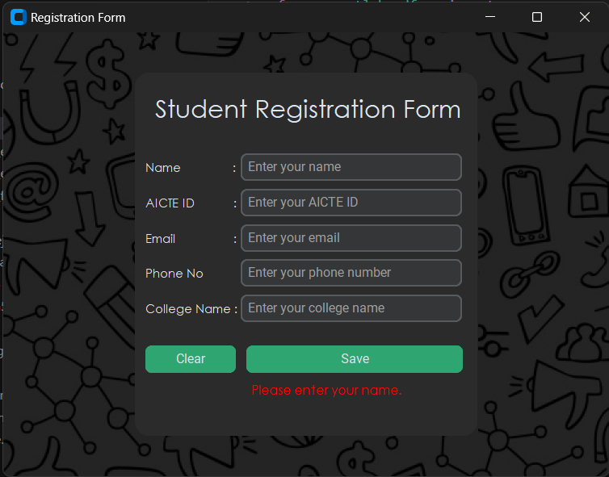

# Student Registration Form with PDF Generator

This is a simple GUI application built using Tkinter in Python that allows students to fill out their registration information, validate the input, and generate a PDF document containing the information provided.

## Features
- User-friendly interface for entering registration details.
- Input validation for ensuring the correctness of entered data.
- PDF generation of the registration information for easy storage and sharing.

## Requirements
- Python 3.x
- Tkinter (usually comes pre-installed with Python)
- ReportLab library for PDF generation (`pip install reportlab`)

## Usage
1. Clone the repository to your local machine.
2. Install the required dependencies if not already installed.
3. Run the `registration_form.py` file.
4. Fill out the registration form with your details.
5. Click on the "Submit" button.
6. If all the entered data is valid, a PDF file containing the information will be generated in the same directory.
